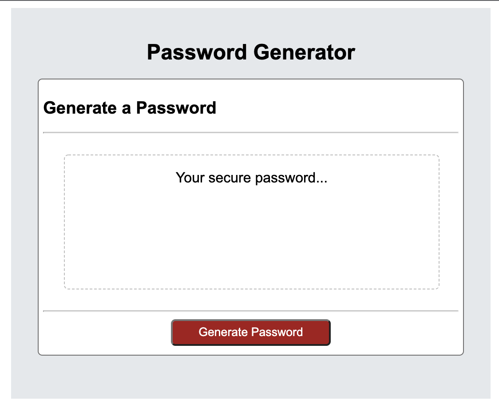

# Password Generator 
This is a password generator that will generate a password based on a user's inputs. 

## How it works?
---
The user is prompted to select what characters their desired password will consist of. It can generate passwords using: 
* lowercase letters
* upper case letters
* numbers
* special characters 

## What are the requirements?
---
The user must select a length between 8 and 128 in order for this to generate a password. The user must also select one of the following of the following characters: lowercase letters, upper case letters, numbers, and special characters. If one is not selected, the password will not be generated.

## Preview of Application
---

## Link to Application
---
https://triciaax.github.io/password-generator/ 

